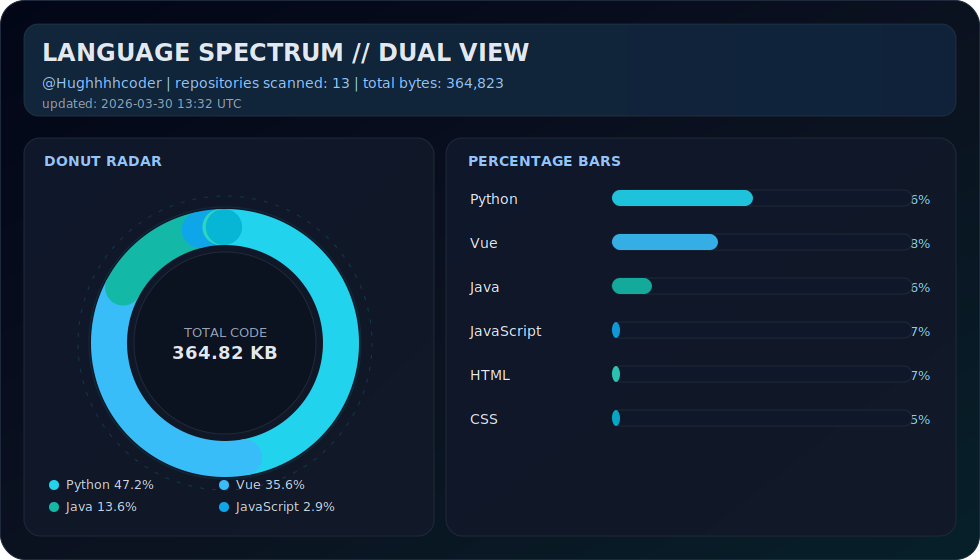

<p align="center">
  
</p>

<p align="center">
  
  
  
  
</p>

<p align="center">
  <code>MODE: DESIGN x ENGINEERING x AI PRODUCT</code>
</p>

## /about

- Product-minded full-stack developer focused on clean UX and resilient architecture.
- Building useful AI products with `Vue + TypeScript + FastAPI + MySQL + Redis`.
- Motto: **慢慢走，比较快**.

## /tech_matrix

<p align="center">
  
</p>

## /language_spectrum

<p align="center">
  
</p>

<p align="center">
  <sub>Dual-view (donut + bars), auto-updated daily from all public repositories (including forks).</sub>
</p>

## /mission_log

```text
[01] Ship useful AI features with production reliability
[02] Balance product taste, speed, and maintainability
[03] Keep iterating: slow is smooth, smooth is fast
```

## /signals

<p align="center">
  
</p>

<p align="center">
  
</p>

## /connect

<p align="center">
  <a href="https://github.com/Hughhhhcoder">
    
  </a>
  <a href="mailto:Hughz@gmail.com">
    
  </a>
</p>
