  <picture>
    <source media="(prefers-color-scheme: dark)" srcset="./assets/experience-dark.svg" />
    <source media="(prefers-color-scheme: light)" srcset="./assets/experience-light.svg" />
    
  </picture>

  <a href="https://github.com/Hughhhhcoder">GitHub</a>
  ·
  <a href="mailto:Hughz@gmail.com">Email</a>

  Auto-generated local SVG experience. Dark and light themes are fully GitHub-compatible with no external card dependencies.

