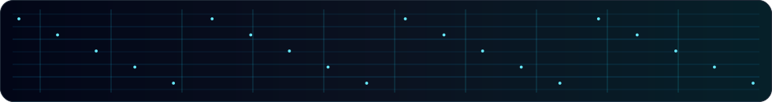
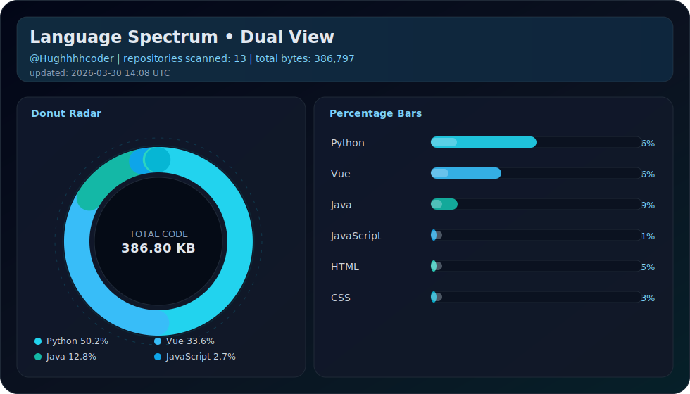

<p align="center">
  <picture>
    <source media="(prefers-color-scheme: dark)" srcset="https://capsule-render.vercel.app/api?type=waving&height=250&text=HughhhhCoder&fontSize=58&fontAlign=50&fontAlignY=36&desc=Design%20x%20Engineering%20x%20AI&descAlign=50&descAlignY=58&animation=twinkling&color=0:020617,40:0f172a,75:0f766e,100:0ea5e9&fontColor=e2e8f0" />
    <source media="(prefers-color-scheme: light)" srcset="https://capsule-render.vercel.app/api?type=waving&height=250&text=HughhhhCoder&fontSize=58&fontAlign=50&fontAlignY=36&desc=Design%20x%20Engineering%20x%20AI&descAlign=50&descAlignY=58&animation=twinkling&color=0:f8fafc,35:e0f2fe,70:bae6fd,100:38bdf8&fontColor=0f172a" />
    
  </picture>
</p>

<p align="center">
  <picture>
    <source media="(prefers-color-scheme: dark)" srcset="./assets/motion-strip-dark.svg" />
    <source media="(prefers-color-scheme: light)" srcset="./assets/motion-strip-light.svg" />
    
  </picture>
</p>

<p align="center">
  
  
  
  
</p>

<p align="center">
  <strong>MODE:</strong> Design x Engineering x AI Product
</p>

## About

- Product-minded full-stack developer focused on clean UX and resilient architecture.
- Building useful AI products with `Vue + TypeScript + FastAPI + MySQL + Redis`.
- Motto: **慢慢走，比较快**.

<p align="center">
  <picture>
    <source media="(prefers-color-scheme: dark)" srcset="./assets/motion-strip-dark.svg" />
    <source media="(prefers-color-scheme: light)" srcset="./assets/motion-strip-light.svg" />
    
  </picture>
</p>

## Tech Stack

<p align="center">
  <picture>
    <source media="(prefers-color-scheme: dark)" srcset="https://skillicons.dev/icons?i=vue,ts,tailwind,python,fastapi,mysql,redis,docker,git,linux&theme=dark&perline=10" />
    <source media="(prefers-color-scheme: light)" srcset="https://skillicons.dev/icons?i=vue,ts,tailwind,python,fastapi,mysql,redis,docker,git,linux&theme=light&perline=10" />
    
  </picture>
</p>

<p align="center">
  <picture>
    <source media="(prefers-color-scheme: dark)" srcset="./assets/motion-strip-dark.svg" />
    <source media="(prefers-color-scheme: light)" srcset="./assets/motion-strip-light.svg" />
    
  </picture>
</p>

## Language Spectrum

<p align="center">
  <picture>
    <source media="(prefers-color-scheme: dark)" srcset="./assets/language-radar-dark.svg" />
    <source media="(prefers-color-scheme: light)" srcset="./assets/language-radar-light.svg" />
    
  </picture>
</p>

<p align="center">
  <sub>Dual-view radar + bars. Auto-updated daily. Private repositories are included when <code>PROFILE_STATS_PAT</code> is configured.</sub>
</p>

<p align="center">
  <picture>
    <source media="(prefers-color-scheme: dark)" srcset="./assets/motion-strip-dark.svg" />
    <source media="(prefers-color-scheme: light)" srcset="./assets/motion-strip-light.svg" />
    
  </picture>
</p>

## Mission Log

```text
[01] Ship useful AI features with production reliability
[02] Balance product taste, speed, and maintainability
[03] Keep iterating: slow is smooth, smooth is fast
```

<p align="center">
  <picture>
    <source media="(prefers-color-scheme: dark)" srcset="./assets/motion-strip-dark.svg" />
    <source media="(prefers-color-scheme: light)" srcset="./assets/motion-strip-light.svg" />
    
  </picture>
</p>

## Signals

<p align="center">
  <picture>
    <source media="(prefers-color-scheme: dark)" srcset="https://streak-stats.demolab.com?user=Hughhhhcoder&theme=tokyonight&hide_border=true" />
    <source media="(prefers-color-scheme: light)" srcset="https://streak-stats.demolab.com?user=Hughhhhcoder&theme=default&hide_border=true" />
    
  </picture>
</p>

<p align="center">
  <picture>
    <source media="(prefers-color-scheme: dark)" srcset="https://github-readme-activity-graph.vercel.app/graph?username=Hughhhhcoder&bg_color=020617&color=7dd3fc&line=22d3ee&point=e2e8f0&area=true&hide_border=true" />
    <source media="(prefers-color-scheme: light)" srcset="https://github-readme-activity-graph.vercel.app/graph?username=Hughhhhcoder&bg_color=f8fafc&color=0f172a&line=0284c7&point=0ea5e9&area=true&hide_border=true" />
    
  </picture>
</p>

<p align="center">
  <picture>
    <source media="(prefers-color-scheme: dark)" srcset="./assets/motion-strip-dark.svg" />
    <source media="(prefers-color-scheme: light)" srcset="./assets/motion-strip-light.svg" />
    
  </picture>
</p>

## Connect

<p align="center">
  <a href="https://github.com/Hughhhhcoder">
    
  </a>
  <a href="mailto:Hughz@gmail.com">
    
  </a>
</p>
