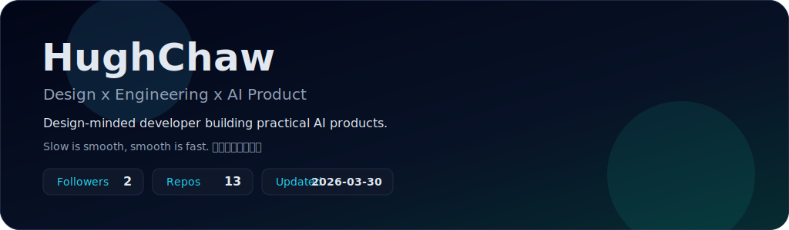
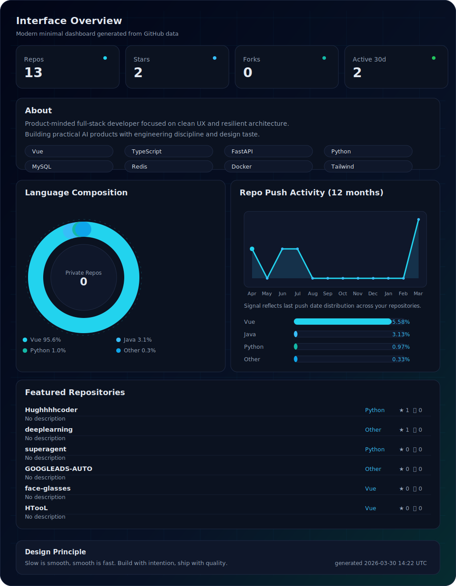

  <picture>
    <source media="(prefers-color-scheme: dark)" srcset="./assets/hero-dark.svg" />
    <source media="(prefers-color-scheme: light)" srcset="./assets/hero-light.svg" />
    
  </picture>

  <picture>
    <source media="(prefers-color-scheme: dark)" srcset="./assets/core-dark.svg" />
    <source media="(prefers-color-scheme: light)" srcset="./assets/core-light.svg" />
    
  </picture>

  <a href="https://github.com/Hughhhhcoder">GitHub</a>
  ·
  <a href="mailto:Hughz@gmail.com">Email</a>

  
    Fully animated dark/light profile UI. Auto-generated daily by GitHub Actions with private repo support via <code>PROFILE_STATS_PAT</code>.
  

