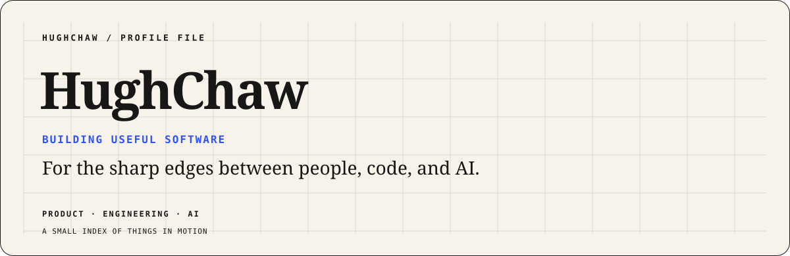

  <picture>
    <source media="(prefers-color-scheme: dark)" srcset="./assets/hero-dark.svg" />
    <source media="(prefers-color-scheme: light)" srcset="./assets/hero-light.svg" />
    
  </picture>

 

  <a href="#selected-work">WORK</a>
  &nbsp;&nbsp;·&nbsp;&nbsp;
  <a href="#recent-activity">ACTIVITY</a>
  &nbsp;&nbsp;·&nbsp;&nbsp;
  <a href="#toolbox">TOOLBOX</a>
  &nbsp;&nbsp;·&nbsp;&nbsp;
  <a href="https://github.com/Hughhhhcoder">GITHUB ↗</a>

 

  <picture>
    <source media="(prefers-color-scheme: dark)" srcset="https://readme-typing-svg.demolab.com?font=JetBrains+Mono&weight=500&size=16&duration=3200&pause=1100&color=B8FF5A&center=true&vCenter=true&width=760&height=30&lines=building+small+tools+with+sharp+edges;shipping+quietly%2C+iterating+often;product+clarity+over+feature+noise" />
    <source media="(prefers-color-scheme: light)" srcset="https://readme-typing-svg.demolab.com?font=JetBrains+Mono&weight=500&size=16&duration=3200&pause=1100&color=2F52FF&center=true&vCenter=true&width=760&height=30&lines=building+small+tools+with+sharp+edges;shipping+quietly%2C+iterating+often;product+clarity+over+feature+noise" />
    
  </picture>

 

## HughChaw / `profile`

Product-minded engineer building practical software at the seam between interfaces, automation, and AI.

Right now, I am exploring browser-first utilities, remote AI workflows, and the small details that make complex tools feel calm.

 

## Selected work

<table>
  <tr>
    <td width="50%" valign="top">
      <strong>01 / HTooL</strong> 
      Browser-first utilities for writing, images, QR codes, data processing, and IP lookup.
        
      <a href="https://htool.vercel.app/">LIVE DEMO ↗</a>
      &nbsp;·&nbsp;
      <a href="https://github.com/Hughhhhcoder/HTooL">SOURCE ↗</a>
        
      <code>Vue</code> <code>Vite</code> <code>local-first</code>
    </td>
    <td width="50%" valign="top">
      <strong>02 / Remote Claude Code</strong> 
      Drive Claude Code from anywhere through a secure, auditable remote workspace.
        
      <a href="https://github.com/Hughhhhcoder/remote-claude-code">READ THE BUILD ↗</a>
        
      <code>TypeScript</code> <code>WebSocket</code> <code>PWA</code>
    </td>
  </tr>
  <tr>
    <td colspan="2" valign="top">
      <strong>03 / SuperAgent</strong> 
      A squad-based orchestrator for development, research, and content workflows.
        
      <a href="https://github.com/Hughhhhcoder/superagent">OPEN REPOSITORY ↗</a>
      &nbsp;·&nbsp;
      <code>Python</code> <code>orchestration</code> <code>agents</code>
    </td>
  </tr>
</table>

 

## Recent activity

The list below is refreshed by a scheduled GitHub Action from public events on my account.

<!-- RECENT_ACTIVITY:start -->
- ⬆️ Pushed 1 commit to [HTooL](https://github.com/Hughhhhcoder/HTooL) on `master` · Aug 18, 2026
- ⬆️ Pushed 1 commit to [HTooL](https://github.com/Hughhhhcoder/HTooL) on `master` · Aug 18, 2026
- ⭐ Starred [HTooL](https://github.com/Hughhhhcoder/HTooL) · Aug 18, 2026
- ⬆️ Pushed 1 commit to [HTooL](https://github.com/Hughhhhcoder/HTooL) on `agent/refresh-github-face` · Aug 18, 2026
- 🎉 Merged PR [PR #9](https://github.com/Hughhhhcoder/HTooL/pull/9) in [HTooL](https://github.com/Hughhhhcoder/HTooL) · Aug 18, 2026
<!-- RECENT_ACTIVITY:end -->
<!-- RECENT_ACTIVITY:last_update -->
Updated 2026-08-18 08:33 UTC
Updated 2026-08-18 08:32 UTC

 

## Activity, in motion

  <a href="https://github.com/Hughhhhcoder">
    <picture>
      <source media="(prefers-color-scheme: dark)" srcset="https://github-readme-activity-graph.vercel.app/graph?username=Hughhhhcoder&bg_color=171B1C&color=F5F1E8&line=B8FF5A&point=FF9A76&area=true&hide_border=true&custom_title=Activity%20in%20motion&days=31" />
      <source media="(prefers-color-scheme: light)" srcset="https://github-readme-activity-graph.vercel.app/graph?username=Hughhhhcoder&bg_color=F7F3EA&color=171717&line=2F52FF&point=E85D3A&area=true&hide_border=true&custom_title=Activity%20in%20motion&days=31" />
      
    </picture>
  </a>

 

  
<strong>Toolbox / things I reach for</strong>

   
  <code>Vue</code>
  <code>TypeScript</code>
  <code>Python</code>
  <code>FastAPI</code>
  <code>Vite</code>
  <code>Node.js</code>
  <code>GitHub Actions</code>
  <code>Playwright</code>
    
  I care less about collecting tools and more about choosing the smallest set that keeps an idea understandable, testable, and useful.

 

## Contribution loop

  <picture>
    <source media="(prefers-color-scheme: dark)" srcset="./assets/github-snake-dark.svg" />
    <source media="(prefers-color-scheme: light)" srcset="./assets/github-snake.svg" />
    
  </picture>
   
  The native GitHub Contribution activity stays below this README — this is just the moving sketch.

 

  <a href="https://github.com/Hughhhhcoder">HUGHHHCODER</a>
  &nbsp;·&nbsp;
  <a href="https://github.com/Hughhhhcoder?tab=repositories">ALL REPOSITORIES ↗</a>

